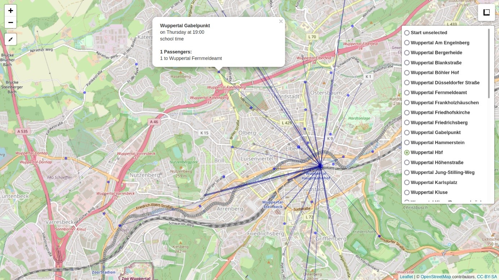
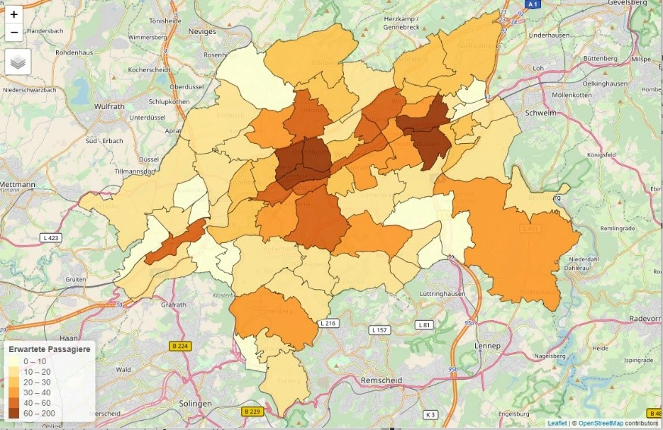

**
Comparative Analysis of Bus and Ridepooling Services in Wuppertal
**

*The purpose of this repository is to partially archive the program code related to the project ''Dynamical Route Planning for On-Demand Ride-Hailing Services'' (subproject of Bergisch Smart Mobility, 2019-2022).*

**Project Team:** Prof. Dr. Hanno Gottschalk, Prof. Dr. Kathrin Klamroth, Dr. Hayk Asatryan, Dr. Daniela Gaul, Dr. Michael Stiglmayr

**Institution:** University of Wuppertal, School of Mathematics and Natural Sciences

**Project partner:** [Aptiv](https://www.aptiv.com), [BSW](https://www.bergische-gesellschaft.de), [WSW](https://www.wsw-online.de)

**Project Overview**

* **Ride-Hailing Service:** The project contributed to the development of a ride-hailing service offered by WSW, now available as [Hol mich! App](https://play.google.com/store/apps/details?id=wuppertal.holmich&hl=en).
* **Predictive Simulation:** A predictive simulation framework was developed using R to simulate transport requests and compare service quality.
* **Machine Learning:** Generalized linear models and classification models were used for demand prediction and trip destination prediction.
* **Dynamic Dial-a-Ride Problem:** The framework solved the dynamic dial-a-ride problem using a rolling-horizon algorithm with a feasible-path heuristic.
* **Focus on Late Evening Hours:** The comparison of bus and ridepooling services was specifically conducted during late evening hours.
* **Visualization Tool:** A leaflet-based HTML map was used to visualize simulation results.
* **Service Extension Analysis:** The project analyzed demand patterns and proposed potential extensions for the ride-hailing service.

**Key Features**

* **Predictive Simulation:** Generates realistic transport requests based on historical data.
* **Demand Modeling:** Employs generalized linear models for accurate demand forecasting.
* **Destination Prediction:** Utilizes classification models to predict trip destinations.
* **Dynamic Dial-a-Ride Problem:** Solves the problem using a rolling-horizon algorithm.
* **Feasible-Path Heuristic:** Improves algorithm performance in high-demand scenarios.

**Visualization Tool**

The following visualization map displays stations as markers with radii proportional to boarding numbers. Hovering over a marker provides station details, while clicking shows boarding information and destinations:

**Service Extension Analysis**

The analysis of demand patterns and potential extension suggestions for the ride-hailing service can be visualized as follows:

**Publications**

- Asatryan H., Gaul D., Gottschalk H., Klamroth K., Stiglmayr M. *Ridepooling and public bus services: A comparative case-study.* – Preprint (2023), [arXiv:2302.01709](https://arxiv.org/abs/2302.01709)

* **Links**

* [Bergisch Smart Mobility](https://www.bergischsmartmobility.de/)
* [Hol mich! App](https://play.google.com/store/apps/details?id=wuppertal.holmich&hl=en)
* [Homepage on GitHub Pages](https://h-asatryan.github.io/ride-hailing-route-planning)
